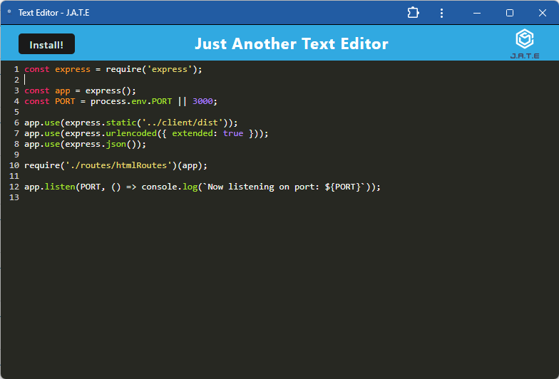

# PWA Text Editor
- [Link to GitHub repository](https://github.com/swokamoto/text-editor-pwa)
- [Link to deployed site](https://text-editor-pwa-n7bn.onrender.com/)
## Table of Contents

- [PWA Text Editor](#pwa-text-editor)
  - [Table of Contents](#table-of-contents)
  - [Description](#description)
  - [Installation](#installation)
  - [Usage](#usage)
  - [Contributing](#contributing)
  - [Questions](#questions)
## Description
This is a Text  Editor. It is a PWA (Progressive Web App) that can be installed onto your local device. This will allow you to operate the app while off-line. 

## Installation
Run `npm install` to get the required packages for both the client and server. 
## Usage
To start the application, enter `npm start`. Follow http://localhost:3001/ to view the app in your browser. From there you can follow the prompts to install the app to you local device.
## Contributing
Please follow the [Contributor Covenant](https://www.contributor-covenant.org/) guidelines.
## Questions
If you have any questions, please reach out to me at swokamoto@gmail.com. 
